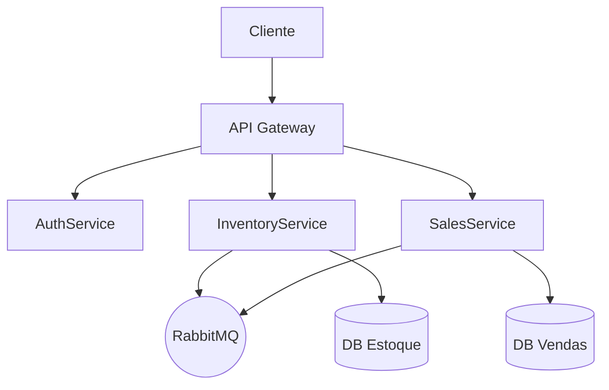

README.md
==============================
# Microserviços – Estoque, Vendas e Autenticação (JWT)

Este repositório demonstra uma arquitetura de microserviços em .NET para e-commerce, com **API Gateway**, **AuthService (JWT)**, **InventoryService** e **SalesService**, usando **RabbitMQ** para comunicação assíncrona.

## Arquitetura



- **API Gateway**: ponto único de entrada e roteamento.
- **AuthService**: emite tokens **JWT** via `/login`.
- **InventoryService**: catálogo e controle de estoque, protegido por JWT.
- **SalesService**: criação/consulta de pedidos, valida estoque e publica eventos de venda.
- **RabbitMQ**: mensageria para notificações e integração assíncrona. A fila padrão utilizada pelos serviços é `sales`.
- **Bancos Relacionais**: um por serviço (ex.: SQL Server/PostgreSQL).

## Requisitos de Ambiente

- [.NET SDK 8.0](https://dotnet.microsoft.com/en-us/download)
- Banco relacional (SQL Server ou PostgreSQL)
- [RabbitMQ](https://www.rabbitmq.com/download.html)
- Docker (opcional para subir dependências localmente)

## Execução

1. Instale e suba RabbitMQ e o banco.
2. Configure strings de conexão/variáveis de ambiente dos serviços.
   O `SalesService` usa SQLite local por padrão (`Data Source=sales.db`). Para utilizar outro banco, defina a variável de ambiente `DATABASE_URL`.

   ```bash
   export DATABASE_URL="Server=localhost;Database=SalesDb;User Id=sa;Password=Your_password123;"
   ```

3. Compile e execute:
   ```bash
   dotnet build
   dotnet run --project ApiGateway
   dotnet run --project AuthService
   dotnet run --project InventoryService
   dotnet run --project SalesService
   ```
4. Acesse os endpoints via **API Gateway**.

## Autenticação (JWT)

1. Obtenha um token:
   ```bash
   curl -X POST http://localhost:3001/login      -H "Content-Type: application/json"      -d '{"username":"user","password":"pass"}'
   ```
   Resposta:
   ```json
   { "token": "<jwt>" }
   ```
2. Use o token nos serviços protegidos:
   ```bash
   curl http://localhost:3002/items -H "Authorization: Bearer <jwt>"
   curl http://localhost:3003/sales -H "Authorization: Bearer <jwt>"
   curl http://localhost:3000/status -H "Authorization: Bearer <jwt>"  # via Gateway
   ```

## Desenvolvimento

- `dotnet restore` para restaurar pacotes.
- Cada serviço em pasta própria; siga princípios REST, validações e tratamento de erros.
- Eventos de venda disparam atualização de estoque via RabbitMQ.

## Contribuição

Abra issues e PRs com correções e melhorias.


==============================
.gitignore
==============================
```gitignore
# --- Build output (.NET)
bin/
obj/

# --- Visual Studio
.vs/

# --- Dotnet user settings
*.user

# --- Node.js (para frontends/scripts)
node_modules/
npm-debug.log*
yarn-error.log*
pnpm-debug.log*
dist/
.build/
```
