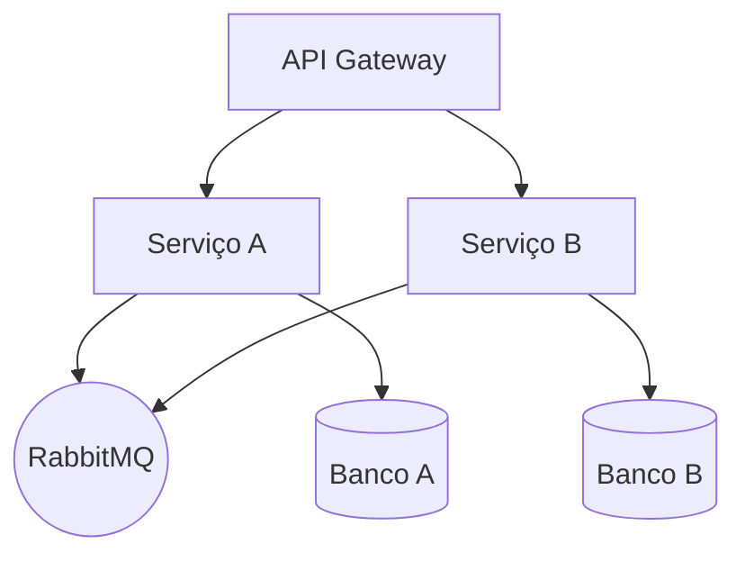

# Microserviços Avanade

Este repositório demonstra uma arquitetura de microserviços baseada na plataforma .NET.

## Arquitetura

A solução é composta por múltiplos serviços independentes que se comunicam por mensageria.
O diagrama a seguir apresenta uma visão simplificada da arquitetura proposta:



## Requisitos de Ambiente

- [RabbitMQ](https://www.rabbitmq.com/download.html)
- Banco de dados relacional (ex.: SQL Server, PostgreSQL)
- [.NET SDK 8.0](https://dotnet.microsoft.com/en-us/download)
- Docker (opcional para execução local de dependências)

## Execução

1. Instale os requisitos acima.
2. Configure RabbitMQ e o banco de dados conforme necessário.
3. Compile e execute os serviços:
   ```bash
   dotnet build
   dotnet run --project ServicoA
   dotnet run --project ServicoB
   ```
4. Utilize o API Gateway para acessar os endpoints expostos.

## Desenvolvimento

- Use `dotnet restore` para restaurar pacotes.
- Crie novos serviços dentro de pastas separadas.

## Contribuição

Sinta-se à vontade para abrir issues e pull requests com melhorias.
